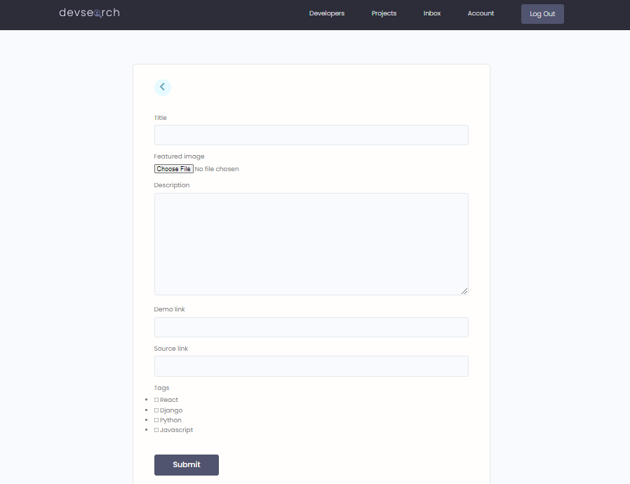

# Devsearch
A social platform for developers where they can connect with same work oriented engineers. Devs can show off their technical skills by flaunting their awesome projects.

## Functionalities : 
### 1. New user need to SignUp and existing users need to SignIn to access all functionalities.

  

### 2. Users can now manage their profile : Personal Info, Interests, Skills, Projects.

  

### 3. Users can perform basic CRUD (Create, Read, Update, Delete) operations on Projects and Skills.

  

### 4. Users can search for Projects, Developrs and Skills within the same search bar.

  

### 5. Users can like and comment on other's work.

  

